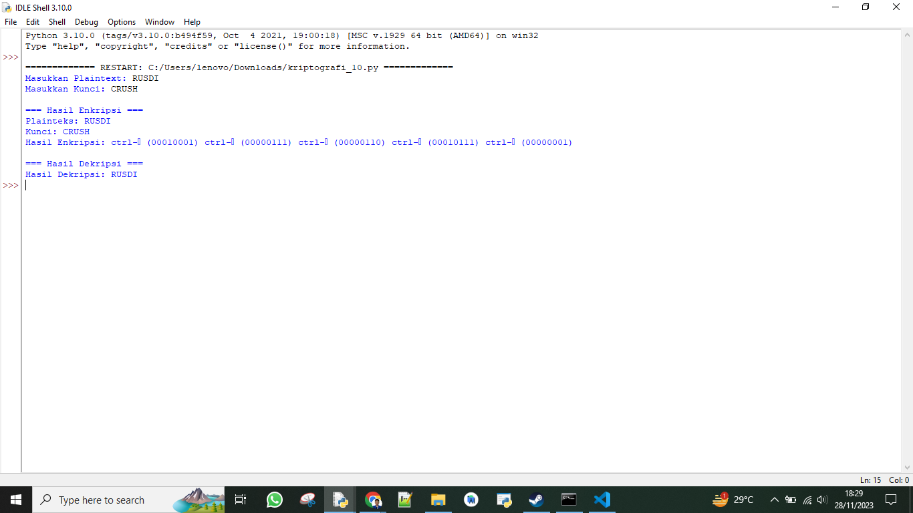
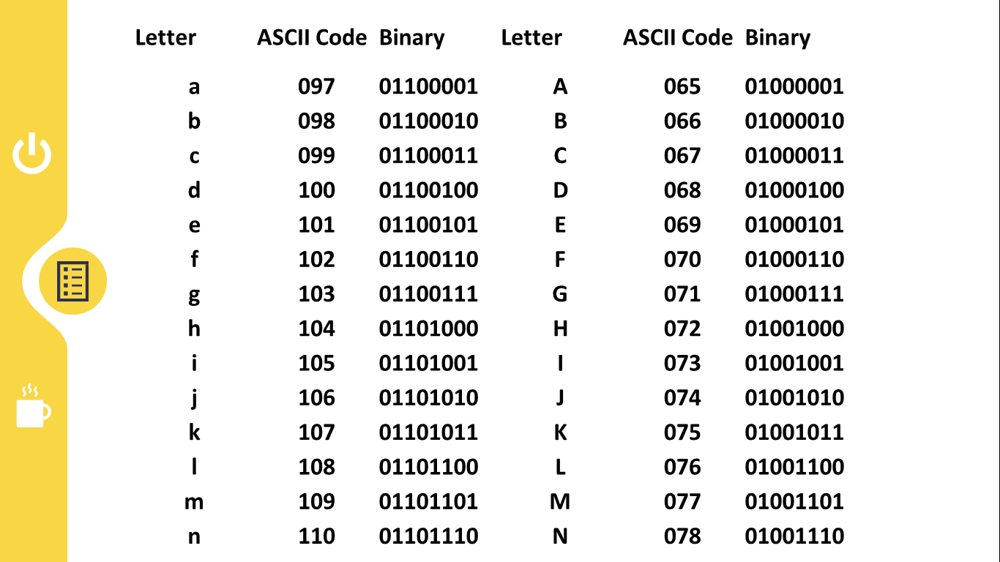

# Kriptografi Pertemuan 10

## Profil
| #               | Biodata                      |
| --------------- | ---------------------------- |
| **Nama**        | M. AKMAL AL ABDILAH          |
| **NIM**         | 312110034                    |
| **Kelas**       | TI.21.A.1                    |
| **Mata Kuliah** | Kriptografi                  |

 

## Implementasi One Time Pad (OTP) di python dan php

1. Python

Contoh Hasil jika di gambarkan

Perintah tugas 

Hasil kode yang sudah di buat dan gambar output ada di bawah ini

Penjelasan singkat hasil kode di gambar atas kenapa ctrl tidak ada hurufnya.

ketika hasil Enkripsi ditampilkan, format keluaran mengandung istilah "ctrl" dan karakter yang dianggap sebagai kontrol ASCII (dengan memanfaatkan nilai desimal dari hasil XOR). Namun, saat menjalankan kode, kita perlu memperhatikan bahwa tidak semua karakter ASCII di bawah 32 adalah karakter kontrol yang dapat ditampilkan secara visual.

Beberapa karakter kontrol tidak memiliki representasi grafis dan mungkin tampak tidak terlihat atau tidak tampak saat ditampilkan di konsol. Oleh karena itu, beberapa karakter kontrol mungkin tidak dapat terlihat saat mencoba menampilkan hasil Enkripsi dengan mencetak karakter kontrol tersebut ke layar.

Sebagai gantinya saya tambahkan nilai biner di setiap ctrl pasti disampinya ada (no biner) agar bisa di lihat huruf di rumus seperti di bawah ini .

Apabila jika ascii masih tidak ada kemungkinan besar di bawah 32 jadi saya mohon maaf kalian bisa memperbaikinya.

Rumus karakter ASCII

 sekian and selesai.

<h2 align="center">Thanks For Reading!!!</h2>

